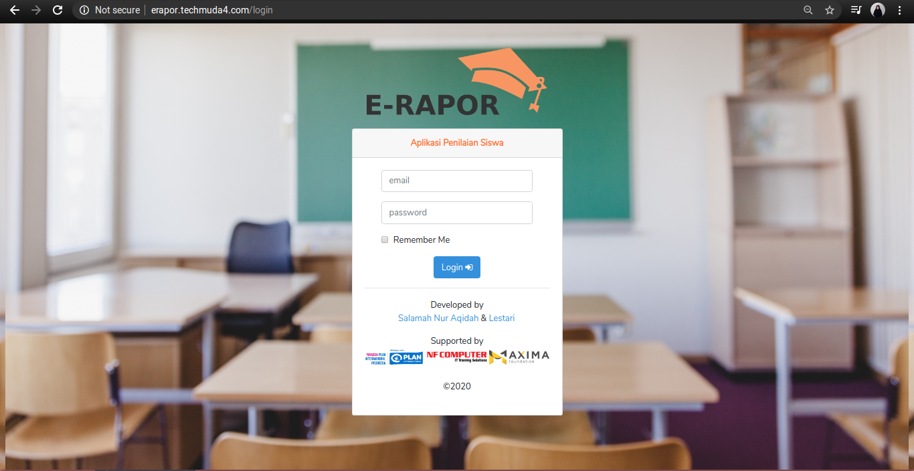
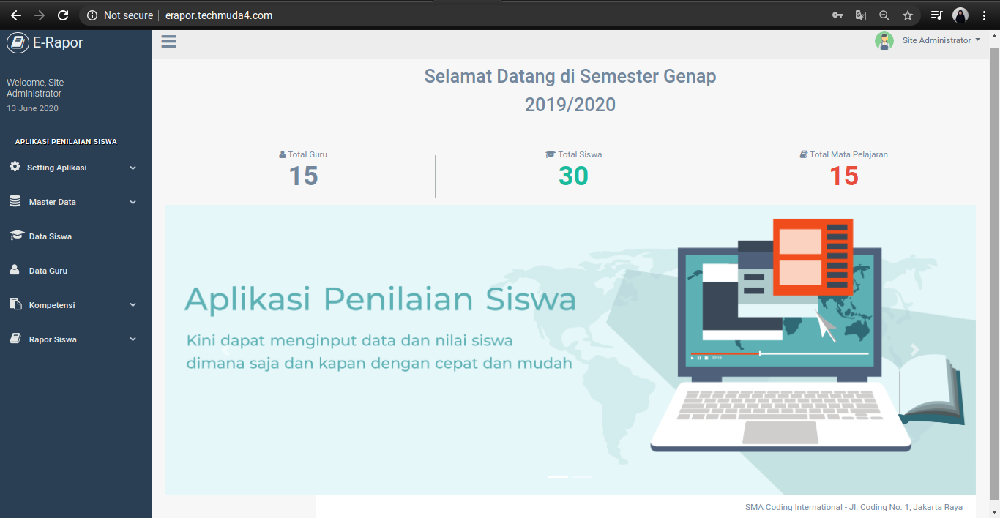

## About E-Rapor

Web application to input final score or student raport. It consists of data management from students, teachers, subjects, and students score.It was developed using bootstrap framework, mySql, dan laravel. This application has several features: 

- User Authentication.
- User Authorization.
- Student Management.
- Teacher Management.
- Subject Management.
- Validation Form.

## Link

- **[E-rapor Application](http://techmuda3.com/salamah/erapor/login/)**
- **[Template](https://colorlib.com/polygon/gentelella/index.html)**

## Preview

    
     
     
     
     
     
     

